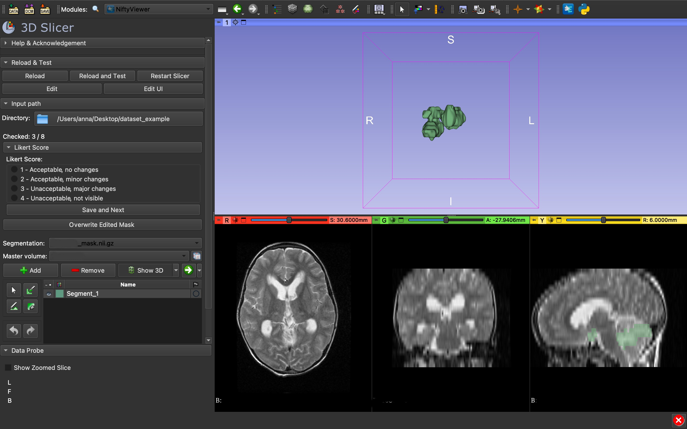

# SlicerSegReview
Slicer3D extension for rating using Likert-type(4 Scale, 1: Acceptable, no changes; 2: Acceptable, minor changes; 3: Unacceptable, major changes; 4: Unacceptable, not visible/wrong location) score Deep-learning generated segmentations, with segment editor. Created to speed up the validation process done by a clinician - the dataset loads in one batch with no need to load masks and volumes separately. The results are saved in a csv file, which can be used for further analysis.



## Adding the extension to Slicer3D
1. Download and unzip this repo.
2. Install additional python dependencies. For that, navigate to the python interactir window in Slicer3D (menu: View / Python Interactor) and run the following commands:
```
slicer.util.pip_install("numpy")
slicer.util.pip_install("pandas") 
slicer.util.pip_install("simpleitk") 
```
3. Add the unzipped path to additional module paths in menu: Edit / Application settings / Modules.
4. Restart Slicer3D (new module should pop up in the module list under "Examples" category)


## Tutorial
1. Prepare the dataset - create a folder with the following structure:
```
- image1.nii.gz
- image1_mask.nii.gz
- image2.nii.gz
- image2_mask.nii.gz
....
```

2. Load the dataset into Slicer3D: 

You will see how many images are loaded under the "Checked" status. If the path is opened the first time, there will be "annotations.csv" file created in the same folder. This file will contain the results of the rating, and will be updated after each rating. Additionaly the "annotations.csv" allows to restore the annotation process in case of a crash/ too many images to rate in one session.

3. Assin the Likert score to the image:

When done, click "Save and Next" to go to the next image. The results will be saved in the "annotations.csv" file. 

4. **Optional** - if you want to change the segmentation mask of the image, you can do it by using the brushes/eraser from the Segment Editor module added to the extension. When done, click "Overwrite edited mask". The new mask will be saved in the same folder as the original mask, with the same name, but with "_upd" added to the end of the name. 

## License: 
This extension is distributed under the terms of the MIT license. See LICENSE.txt for details.
